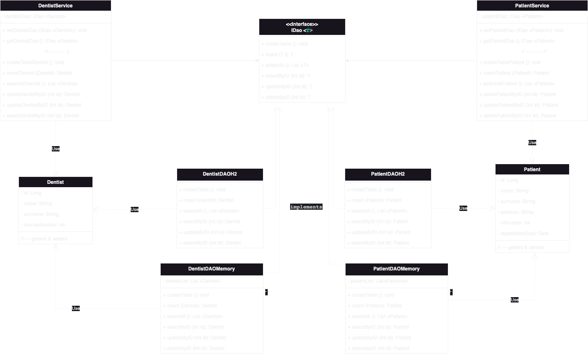
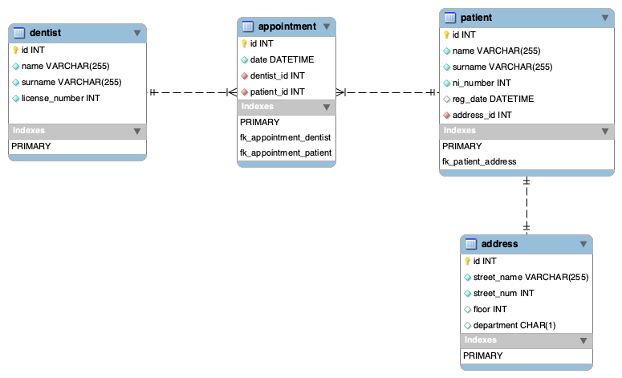

#&emsp;&emsp;&emsp;&emsp;&emsp;&emsp;&emsp;&emsp;&emsp;&emsp;&emsp;&emsp;&emsp;&emsp;&emsp;&emsp;&emsp;&emsp;&emsp;&emsp;&emsp;&emsp;&emsp;&emsp; :hospital: &emsp;Clinic Management System &emsp;:hospital:
 
 
 
  
 

## &emsp;&emsp;&emsp;&emsp;&emsp;&emsp;&emsp;&emsp;&emsp;&emsp;&emsp;&emsp;&emsp;&emsp;&emsp;&emsp;&emsp;&emsp;&emsp;&emsp;&emsp;UML Class Diagram

 
 
 
 

## &emsp;&emsp;&emsp;&emsp;&emsp;&emsp;Enhanced Entity-Relationship Model

