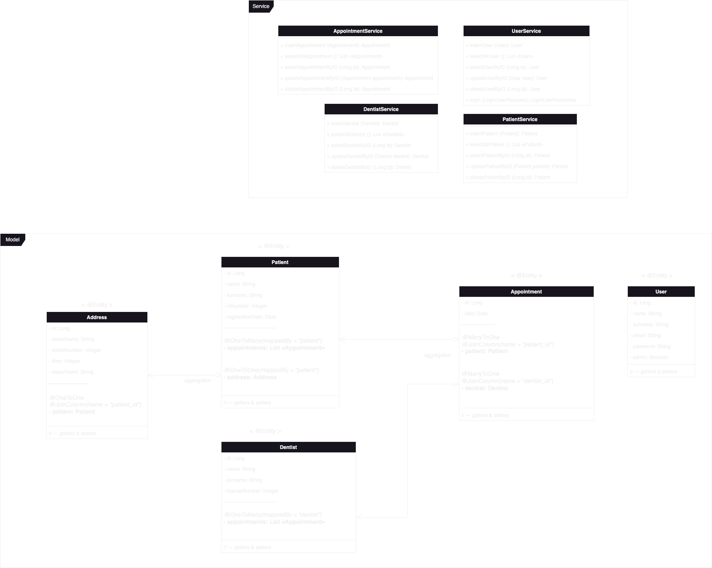
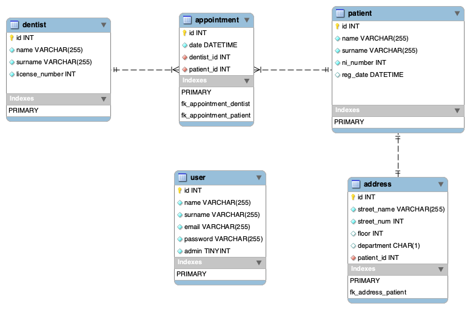

# Dentalcura Clinic Management System

## Project Description

**Overview:**
The Dentalcura Clinic Management System is a comprehensive full-stack web application designed to streamline and optimize the management of dental clinics. This project demonstrates my proficiency in developing end-to-end solutions for real-world business needs.

**Key Features:**

1. **Appointment Management:**
    - Patients can easily schedule, reschedule, or cancel appointments online.
    - Dentists and staff have a centralized view of the clinic's appointment calendar.

2. **Patient Records:**
    - Securely store patient information, including medical history and treatment plans.
    - Ensure data privacy and compliance with healthcare regulations.

3. **Billing and Invoicing:**
    - Generate and manage invoices for services rendered.
    - Track payments and outstanding balances.

4. **User Authentication and Authorization:**
    - Role-based access control ensures the right level of access for different users (admin, dentists, staff, patients).
    - User authentication safeguards sensitive patient data.

5. **Dashboard and Analytics:**
    - Visualize clinic performance with interactive dashboards and charts.
    - Gain insights into appointment trends, revenue, and patient demographics.

6. **Mobile-Friendly Design:**
    - Access the system from any device with a responsive and user-friendly design.

7. **Technology Stack:**
    - Frontend: HTML, CSS, JavaScript, React.js
    - Backend: Java, Spring Boot, Hibernate
    - Database: H2 (for development), MySQL (for production)
    - Security: Spring Security for user authentication and authorization
    - Deployment: Docker containers hosted on AWS (Amazon Web Services)

**Why It Matters:**
The Dentalcura Clinic Management System simplifies daily operations for dental clinics, enhancing the patient experience and improving the efficiency of dental practitioners. It showcases my ability to develop robust, secure, and user-friendly web applications that meet the unique needs of healthcare providers.

**My Role:**
I was the sole developer for this project, responsible for the end-to-end development, from designing the user interface to implementing the backend logic and ensuring data security. This project demonstrates my skills in full-stack development, database management, and UI/UX design.

**Outcome:**
The Dentalcura Clinic Management System is a fully functional solution that can be customized and scaled to meet the needs of various dental clinics. It not only simplifies clinic operations but also ensures the confidentiality and integrity of patient data.

**Next Steps:**
In future iterations, I plan to enhance the system by adding additional features such as telehealth consultations, electronic health record (EHR) integration, and automated appointment reminders to further improve the clinic's efficiency and patient care.

This project is a testament to my ability to create practical, secure, and scalable full-stack solutions for businesses in the healthcare sector. It represents my commitment to delivering high-quality software that addresses real-world challenges.

## &emsp;&emsp;&emsp;&emsp;&emsp;&emsp;&emsp;&emsp;&emsp;&emsp;&emsp;&emsp;&emsp; UML Class Diagram

    

## &emsp;&emsp;&emsp;&emsp;&emsp;&emsp; Enhanced Entity-Relationship Model

  

## &emsp;&emsp;&emsp;&emsp;&emsp;&emsp;&emsp;&emsp;&emsp;&emsp;&emsp;&emsp; REST API
 

 

#### PATIENT:
###### GET $~~~~~~$ &emsp; /patient $~~~~~~~$ &emsp; Get all patients
###### GET $~~~~~~$ &emsp; /patient/{id} &emsp; Get patient by id
###### POST $~~~$ &emsp; /patient $~~~~~~~$ &emsp; Create new patient
###### PUT $~~~~~~$ &emsp; /patient/{id} &emsp; Update patient by id
###### DELETE &emsp; /patient/{id} &emsp; Delete patient by id
 

#### DENTIST:
###### GET $~~~~~~$ &emsp; /dentist $~~~~~~~$ &emsp; Get all dentists
###### GET $~~~~~~$ &emsp; /dentist/{id} &emsp; Get dentist by id
###### POST $~~~$ &emsp; /dentist $~~~~~~~$ &emsp; Create new dentist
###### PUT $~~~~~~$ &emsp; /dentist/{id} &emsp; Update dentist by id
###### DELETE &emsp; /dentist/{id} &emsp; Delete dentist by id
 

#### APPOINTMENT:
###### GET $~~~~~~$ &emsp; /appointment $~~~~~~~$ &emsp; Get all appointments
###### GET $~~~~~~$ &emsp; /appointment/{id} &emsp; Get appointment by id
###### POST $~~~$ &emsp; /appointment $~~~~~~~$ &emsp; Create new appointment
###### PUT $~~~~~~$ &emsp; /appointment/{id} &emsp; Update appointment by id
###### DELETE &emsp; /appointment/{id} &emsp; Delete appointment by id
 

#### USERs:
###### GET $~~~~~~$ &emsp; /user $~~~~~~~$ &emsp; Get all users
###### GET $~~~~~~$ &emsp; /user/{id} &emsp; Get user by id
###### POST $~~~$ &emsp; /user $~~~~~~~$ &emsp; Create new user
###### POST $~~~$ &emsp; /user/login $~~~~~~~$ &emsp; Login user
###### PUT $~~~~~~$ &emsp; /user/{id} &emsp; Update user by id
###### DELETE &emsp; /user/{id} &emsp; Delete user by id
